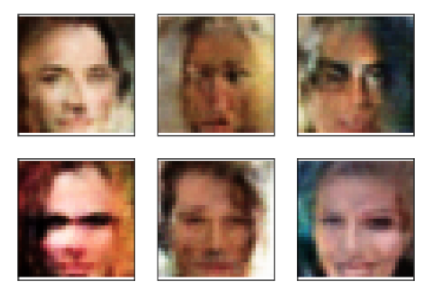

# Генерация изображений лиц

## Постановка задачи

Генерация изображений лиц является классической задачей компьютерного зрения. В
течении последнего десятилетия появилось много подходов решения этой задачи. В
рамках проекта интересно рассмотреть вариационный автокодировщик. Главной
задачей является создание сервиса для генерации лиц с помощью одной из двух
упомянутых выше моделей.

## Формат входных и выходных данных

Данные сервиса: На входе при инференсе данных не требуется, т.к. изображения
генерируются на основе случайного вектора из нормального распределения. На
выходе сервис выдает изображение лица.

## Данные для обучения:

RGB изображения размера 150x150 пикс. лиц людей.

## Метрики

Генеративное моделирование имеет заметные трудности с оценкой качества
генерации. Тем не менее, для задачи генерации лиц подходит визуальный контроль
качества.

## Валидация

Для обучения будет использоваться датасет CelebA, авторы которого предоставляют
готовое разделение на train, val, test.

## Данные

В качестве обучающих данных будем использовать датасет CelebA, содержащий
порядка 200 тыс. изображений лиц высокого разрешения. Особенностью данных
является разнообразие поз людей и масштабов лица на изображении, наличие
головных уборов, очков и иных аксессуаров. Датасет лежит на dropbox, .zip файл
весит около 1.4Гб.

## Моделирование

### Бейзлайн
Классический пример GAN - Deep Convolutional GAN (DCGAN). Пример генерации обученного DCGAN:

### Основная модель
Вариационный автокодировщик. Пример генерации рассматриваемой моделью после обучения на двух эпохах: 

## Setup

0. `git clone https://github.com/AntivistRock/face-generation.git`
1. `cd face-generation`
2. `poetry install`
3. `poetry env activate`, выход команды скопировать в командную строку и
   выполнить
4. `python3 scripts/download_data.py data`
5. `python3 scripts/train_val_split.py data/img_align_celeba/`
6. `dvc add data`
7. `dvc push -r data data`

## Train

1. Проделать предыдущие шаги.
2. В новом терминале перейти в ту же дерикторию (face-generation) и запустить
   `mlflow server --backend-store-uri ./plots --default-artifact-root ./plots --host 127.0.0.1 --port 8080`
3. Вернуться в старый терминал
4. `python3 -m face_generation.train`

## Production preparation

Не было реализовано, т.к. является необязательной частью.

## Infer

0. Проделать предыдущие шаги, если нет чекпоинта в dvc remote.
1. `python3 -m face_generation.inference`

Результат работы будет лежать по пути `plots/gen_example.png`
